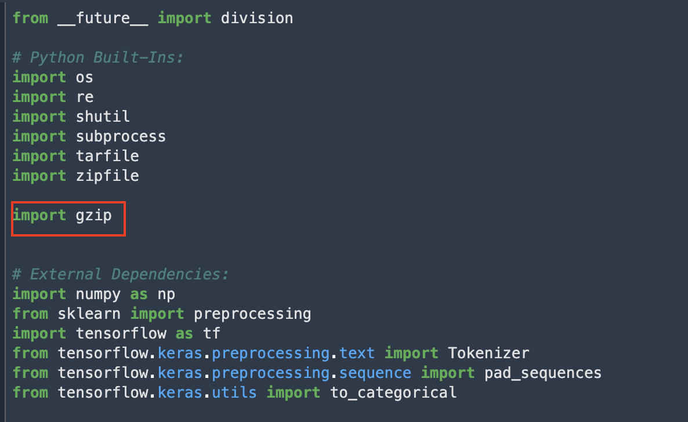
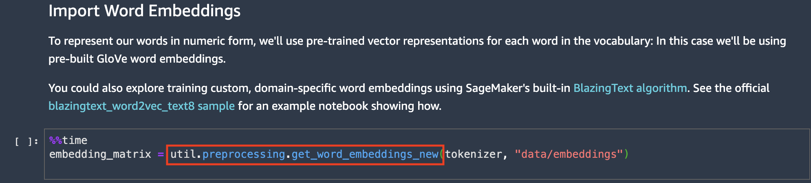
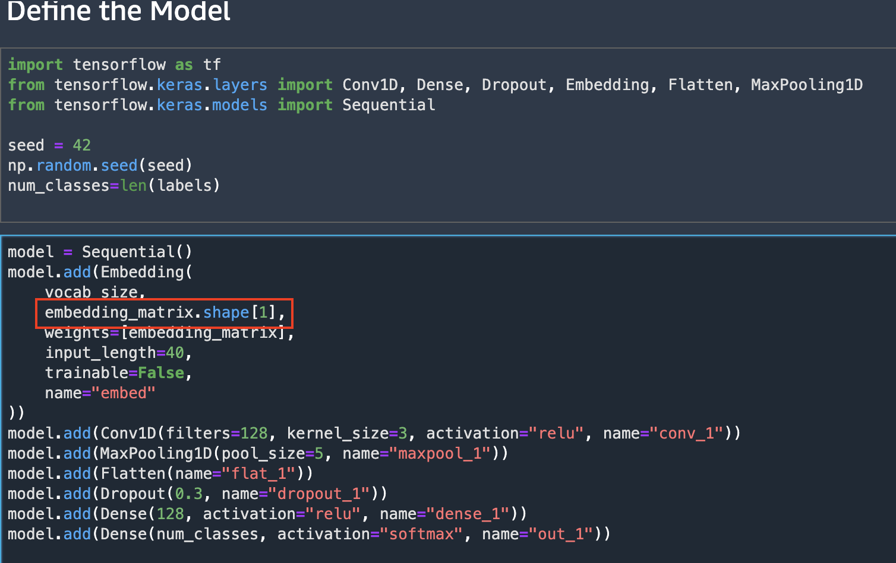
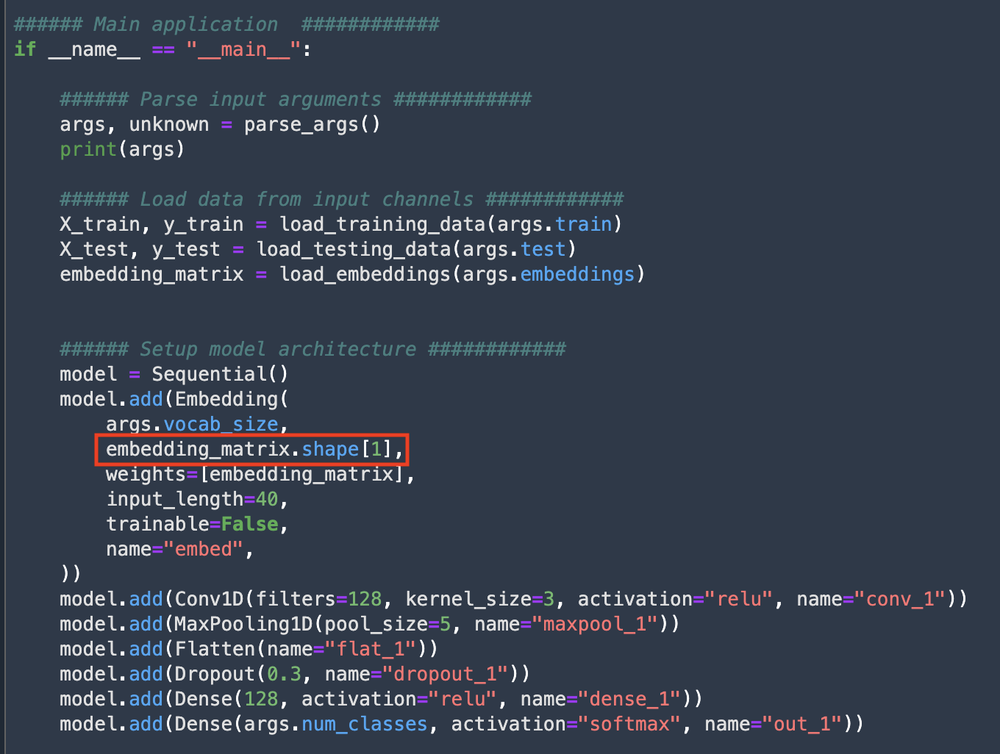

## Custom Deep Learning (NLP)

### on Local Notebook 
1. open file `/sagemaker-101-workshop/custom_tensorflow_keras_nlp/util/preprocessing.py` and declare `import gzip`




2. Please copy and paste this code at the bottom to file `/sagemaker-101-workshop/custom_tensorflow_keras_nlp/util/preprocessing.py`

Previous code:
```
def get_word_embeddings(t, folder):
    os.makedirs(folder, exist_ok=True)
    if os.path.isfile(f"{folder}/glove.6B.100d.txt"):
        print("Using existing embeddings file")
    else:
        print("Downloading Glove word embeddings...")
        subprocess.call(
            [f"wget -O {folder}/glove.6B.zip http://nlp.stanford.edu/data/glove.6B.zip"],
            shell=True,
        )
        with zipfile.ZipFile(f"{folder}/glove.6B.zip", "r") as zip_ref:
            print("Unzipping...")
            zip_ref.extractall(folder)

        try:
            # Remove unnecessary files, don't mind too much if fails:
            for name in ["glove.6B.200d.txt", "glove.6B.50d.txt", "glove.6B.300d.txt", "glove.6B.zip"]:
                os.remove(os.path.join(folder, name))
        except:
            pass

    print("Loading into memory...")
    # load the whole embedding into memory
    embeddings_index = dict()
    with open(f"{folder}/glove.6B.100d.txt", "r", encoding="utf-8") as f:
        for line in f:
            values = line.split()
            word = values[0]
            coefs = np.asarray(values[1:], dtype="float32")
            embeddings_index[word] = coefs
    vocab_size = len(embeddings_index)
    print(f"Loaded {vocab_size} word vectors.")

    # create a weight matrix for words in training docs
    embedding_matrix = np.zeros((vocab_size, 100))
    for word, i in t.word_index.items():
        embedding_vector = embeddings_index.get(word)
        if embedding_vector is not None:
            embedding_matrix[i] = embedding_vector

    return embedding_matrix
```


New code:


```
def get_word_embeddings_new(t, folder):
    os.makedirs(folder, exist_ok=True)
    vecs_url = "https://dl.fbaipublicfiles.com/fasttext/vectors-crawl/cc.en.300.vec.gz"
    vecs_zipped_filename = vecs_url.rpartition("/")[2]
    vecs_filename = vecs_zipped_filename[:-3]

    # Tokenizer.num_words is nullable, and there's an OOV token, so:
    tokenizer_vocab_size = len(t.word_index) + 1

    if os.path.isfile(f"{folder}/cc.en.300.vec"):
        print("Using existing embeddings file")
    else:
        print("Downloading word vectors...")
        subprocess.run([" ".join(["wget", "-NP", folder, vecs_url])], check=True, shell=True)
    
    print("Loading into memory...")
    embeddings_index = dict()
    with gzip.open(os.path.join(folder, vecs_zipped_filename), "rt") as zipf:
        firstline = zipf.readline()
        emb_vocab_size, emb_d = firstline.split(" ")
        emb_vocab_size = int(emb_vocab_size)
        emb_d = int(emb_d)
        for line in zipf:
            values = line.split()
            word = values[0]
            # Only load subset of the embeddings recognised by the tokenizer:
            if word in t.word_index:
                coefs = np.asarray(values[1:], dtype="float32")
                embeddings_index[word] = coefs
    print("Loaded {} of {} word vectors for tokenizer vocabulary length {}".format(
        len(embeddings_index),
        emb_vocab_size,
        tokenizer_vocab_size,
    ))

    # create a weight matrix for words in training docs
    embedding_matrix = np.zeros((tokenizer_vocab_size, emb_d))
    for word, i in t.word_index.items():
        embedding_vector = embeddings_index.get(word)
        if embedding_vector is not None:
            embedding_matrix[i] = embedding_vector
    return embedding_matrix
```


2. Don't forget to save the file.
3. In section `Import Word Embeddings`, Replace the function `get_word_embeddings` to `get_word_embeddings_new` on notebook `Headline Classifier Local.ipynb`




4. In section `Define the model` in the same notebook (`Headline Classifier Local.ipynb`), please replace `100` to `embedding_matrix.shape[1]`




### On SageMaker Notebook

5. On notebook `Headline Classifier SageMaker.ipynb`, make sure you also replace Replace the function `get_word_embeddings` to `get_word_embeddings_new`


6. Open file `/sagemaker-101-workshop/custom_tensorflow_keras_nlp/src/main.py`, replace the number `100` to `embedding_matrix.shape[1]`



7. In section `Hyperparameter Optimization - Start the Tuning job`, you can include the code `wait=False`

8. In section `Using the model`, you can add new cell code, copy and paste this code:

```
predictor_tuned = tuner.deploy(
    initial_instance_count=1,
    instance_type="ml.t2.medium",
)
```


9. Create next cell code. Copy and paste this code:
```
from IPython import display
import ipywidgets as widgets
from tensorflow.keras.preprocessing.sequence import pad_sequences

def classify(text):
    """Classify a headline and print the results"""
    encoded_example = tokenizer.texts_to_sequences([text])
    # Pad documents to a max length of 40 words
    max_length = 40
    padded_example = pad_sequences(encoded_example, maxlen=max_length, padding="post")
    result = predictor_tuned.predict(padded_example.tolist())
    print(result)
    ix = np.argmax(result["predictions"])
    print(f"Predicted class: '{labels[ix]}' with confidence {result['predictions'][0][ix]:.2%}")

interaction = widgets.interact_manual(
    classify,
    text=widgets.Text(
        value="The markets were bullish after news of the merger",
        placeholder="Type a news headline...",
        description="Headline:",
        layout=widgets.Layout(width="99%"),
    )
)
interaction.widget.children[1].description = "Classify!"
```